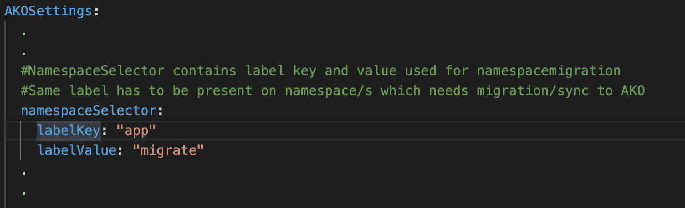
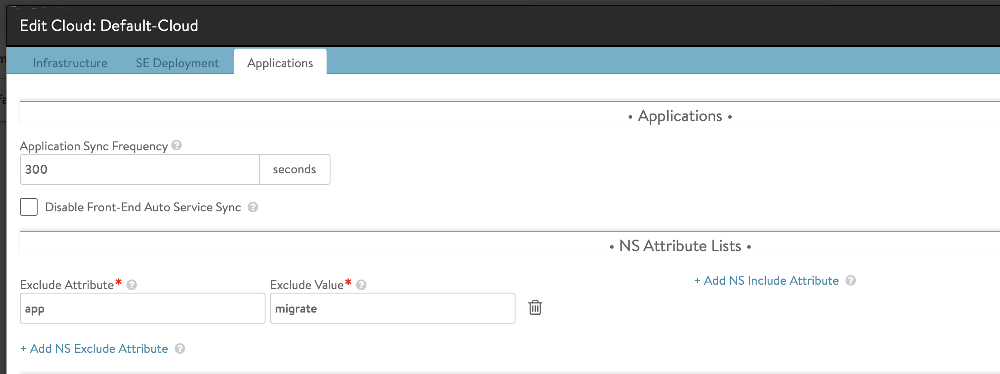
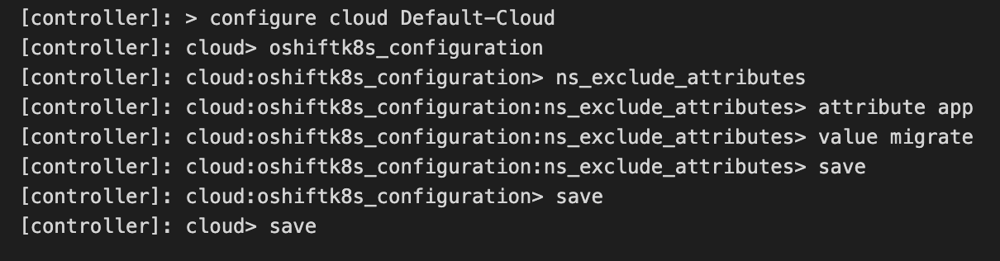
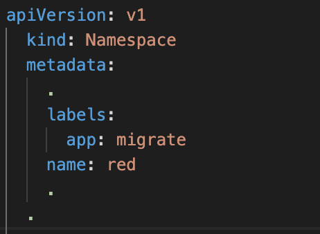

# Cloud connector to AKO migration
## Overview
Cloud connector(CC) is not supported from Avi Controller version 20.1 onwards. To migrate existing workload present in kubernetes cluster from Avi Controller running the OpenShift/Kubernetes cloud using cloud connector to AKO based Avi Controller, following two features will be used.

* <b>Namespace-Driven Inclusion/Exclusion of OpenShift/Kubernetes Applications</b>:

    For migration activity, Exclusion feature allows ingresses/routes from specific namespace(s) to be deleted(excluded) from Avi Controller. For that, namespace has to be labelled with same key:value pair as that of exclude attribute and exclude value mentioned in cloud. This feature is supported in Avi Controller running the OpenShift/Kubernetes cloud using cloud connector.

    Details about how to use exclusion feature can be found [here](https://avinetworks.com/docs/18.2/namespace-inclusion-exclusion-in-openshift-kubernetes/)

* <b>Namespace Sync feature</b>

    This feature is supported by AKO from 1.4.1.

    Namespace sync feature allows K8 objects from specific namespace to be synced with AKO based Avi-Controller. For that, namespace has to be labelled with same key:value pair as that labelKey and labelValue mentioned in `values.yaml` file.

    Details about this feature is present at: [Namespace Sync in AKO](objects.md#namespace-sync-in-ako)

### Environments

This migration activity is currently supported for Vcenter cloud with kubernetes based workloads.

## Workflow

This section gives details about steps of migration.

### 1. Pre-requisites

* Setup a new controller (compatible with AKO version 1.4.1 and above)
* Setup a new Vcenter cloud with write access.
* Setup an IPAM on Vcenter cloud. It will be good to configure IPAM on Vcenter cloud with non-overlapping usable network to avoid IP address conflict or non-availability of IP address after migration.
* Setup a DNS Service on Vcenter cloud.
* Replicate AVI side objects, referred by Ingresses/Services as part of AVI_PROXY annotations, to new controller.
* AKO version should be 1.4.1 and above.

### 2. Deploy AKO CRDs

For each AVI_PROXY annotation present in an ingress, create corresponding AKO Http rule/Host rule/ AviInfrasetting rule.
Details of these CRDs can be found out [here](crds/overview.md)

If any AVI_PROXY annotation is not supported by these CRDs, then VS which is migrated to AKO based Avi Controller will not have same features as that in Avi Controller running the OpenShift/Kubernetes cloud using cloud connector.

Please note: List of AVI_PROXY annotations supported by AKO CRDs will be published soon.

### 3. AKO Deployment

Namespace sync fea

With AKO, SEs are deployed outside kubernetes cluster. So deploy AKO with static routing true or false depending upon POD network reachability and with namespace sync feature enabled.

As an example, AKO is deployed with `app` as a key and `migrate` as a value for namespace selector. So AKO will sync up all objects from namespace(s) which has this label and corresponding Avi objects will be created in Avi-Controller.

### 4. Namespace-Driven Exclusion of OpenShift/Kubernetes Applications

Set an exclude attribute and exclude value for Openshift/Kuberneted Cloud either from UI or AVI shell. Key and value should be same as mentioned in `values.yaml` of AKO.

* Setting up an exclude attribute and exclude value using UI

* Setting up an exclude attribute and exclude value using Avi shell

As an example, exclude attribute as `app` and exclude value as `migrate` is used. This will delete virtual services of namespace(s), which has same label, from Avi Controller running the OpenShift/Kubernetes cloud using cloud connector.

### 5. Kubernetes namespace label

Label namespace(s) in kubernetes cluster with same `key:value` pair.

As shown in above screen-shot, "red" namespace is labelled with "app: migrate". This will result in deletion of virtual services of red namespace from Avi Controller running the OpenShift/Kubernetes cloud using CC and creation of new virtual services for red namespace in AKO based Avi-controller.

Please note that there will be traffic disruption during migration.

### 6. Internal testing

The newly created objects in AKO based Avi Controller may get new VIPs. Hence internal traffic tests need to be performed for migrated applications.

After successful testing, migrate objects from other namespaces by labelling the namespace one by one.

### 7. Client traffic redirection

Once all L4-L7 applications migrated to AKO based Avi controller, client traffic can be redirected to new VIPs by one of the following ways
* Change DNS server entry in corporate DNS server to point to new DNS service on AKO based Avi Controller.
* Change IP address of DNS service running on AKO based Avi Controller with IP address of DNS service present on Avi Controller running the OpenShift/Kubernetes cloud using CC if IPAM from both clouds have overlapping subnets.

### 8. Cloud Connector (Openshift cloud) clean up

Once all kubernetes objects are migrated, old Openshift/Kubernetes cloud can be deleted.

